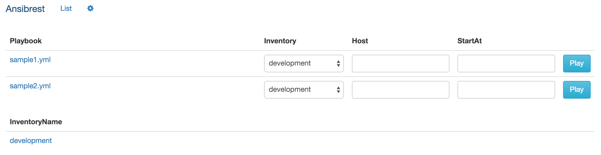
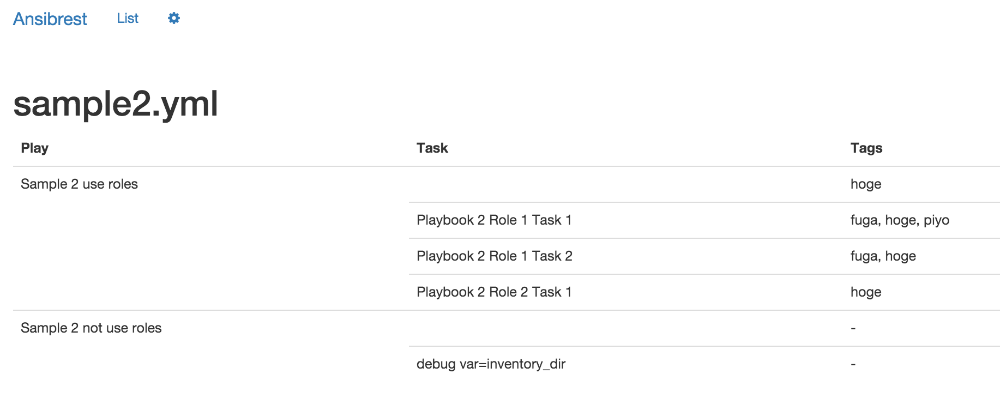
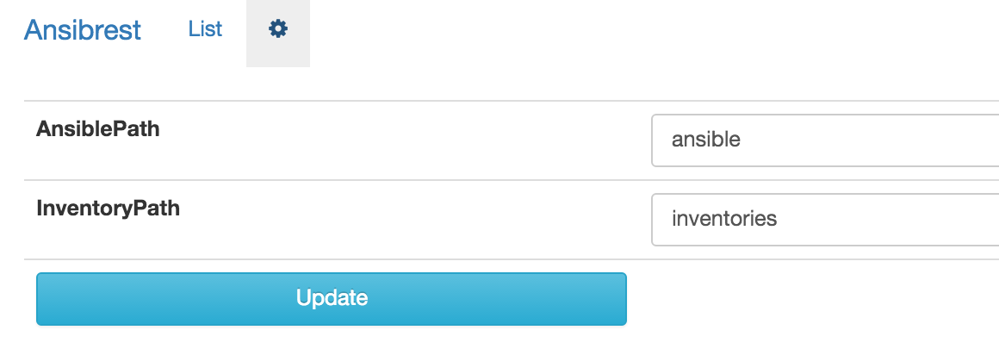
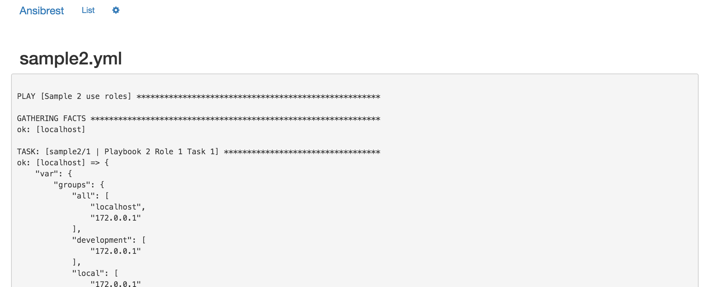

 Ansibrest - Ansible REST Server
-----

## Abstract

Start REST Server to execute local ansible.

## How to use

```
% npm install ansibrest -g
% ansibrest -h

  Usage: ansibrest [options]

  Options:

    -h, --help                         output usage information
    -p,--port <PORT>                   PORT
    --endpoint <ENDPOINT>              ENDPOINT
    --ansible-path <ANSIBLE_PATH>      ANSIBLE_PATH
    --inventory-path <INVENTORY_PATH>  INVENTORY_PATH
```

## Dockerize

```
docker run -d -p 2400:2400 -v $ANSIBLE_PATH:/opt/ansible muddydixon/ansibrest
docker run -d -p 2400:2400 -v $YOURANSIBRRESTFILE:/opt/ansibrest/.ansibrest \
                           -v $ANSIBLE_PATH:/opt/ansible \
                           muddydixon/ansibrest
```


## Contribute

```
% npm install -g git://github.com/muddydixon/ansibrest.git
% cd someproject/
% ls -l
ansible/
% ls ansible
sample1.yml sample2.yml inventories/
% ansibrest --ansible-path ./ansible --inventory-path inventories
% curl -X POST -d "host=samplehost001" -d "startAt=Some Task" "http://localhost:8080/api/playbook/sample1.yml"
```

## Screens

### Top


### Playbook Tasks


### Config


### Execute Playbook

